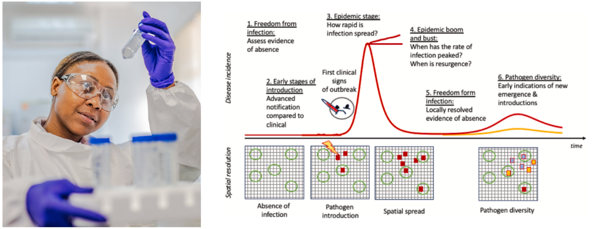

```{r setup, include=FALSE}
knitr::opts_chunk$set(echo = FALSE)
```

<br><br>

The National Institute for Communicable Diseases (NICD) takes pride in its pivotal role as the national public health institute tasked with disease surveillance in South Africa. The Wastewater Genomics Syndicate, situated within the Centre for Vaccines and Immunology at NICD, spearheads wastewater and environmental surveillance (WES) for communicable diseases. <br><br>

Environmental surveillance commenced in 2018 as part of the global effort to eradicate polio. Samples from wastewater treatment plants (WWTP) across the country are tested for polio. In 2020, amidst the challenges posed by the COVID-19 pandemic, the NICD swiftly built on the polio surveillance network to commence WES for SARS-CoV-2. Through meticulous observations and analyses, we demonstrated the efficacy of wastewater analysis as an early detection tool for changes in transmission dynamics and population disease burden. In addition to this, with the incorporation of cutting-edge bioinformatics tools, such as Freyja, it has become possible to identify SARS-CoV-2 variants within wastewater samples. This breakthrough not only reinforces the utility of wastewater surveillance in combating COVID-19 but also provides invaluable insights into population-level disease dynamics and variant circulation. As clinical case numbers decline, wastewater surveillance has become a cornerstone for disease surveillance.<br><br>

Building on these activities, modelling and analysis are required to improve how the wastewater data generated can provide insights that are useful for public health:
::: {}
* The pathogens that we are testing for has expanded. 
* The interpretation of these data require development as the ‘presence/absence’ of polio is for many pathogens too simplistic a measure. On the other hand, quantitative values generated need to be examined against available clinical data so we can better understand the information in the signal.
* By working closely with subject experts, we will evaluate the utility of wastewater measures for these additional pathogens within South Africa, and provide information that can be useful for additional settings where there is an absence of reliable clinical data.
:::

Additonal resources:
:::{}
* A [Weekly South Africa Wastewater Dashboard](https://www.nicd.ac.za/diseases-a-z-index/disease-index-covid-19/surveillance-reports/weekly-respiratory-pathogens-surveillance-report-week/)
* A [Wastewater Documentation Repo](https://github.com/NICD-Wastewater-Genomics/NICD-Wastewater-Genomics.github.io)
:::

[#::: {.column-margin}
# note we could add a twitter feed here
#<script async src="https://bst.heion.net/timeline.js" data-handle="epiforecasts.io" data-theme="light" data-width="420" data-height="500" data-lang="en" data-pin="0"></script>
#
#:::
]: #
